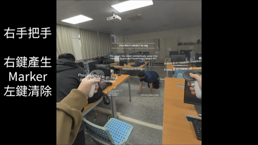
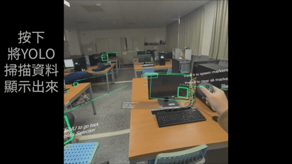
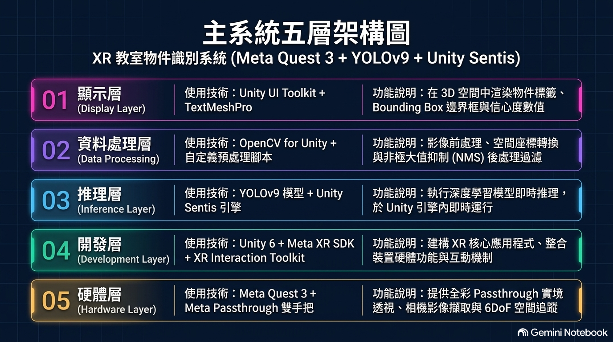
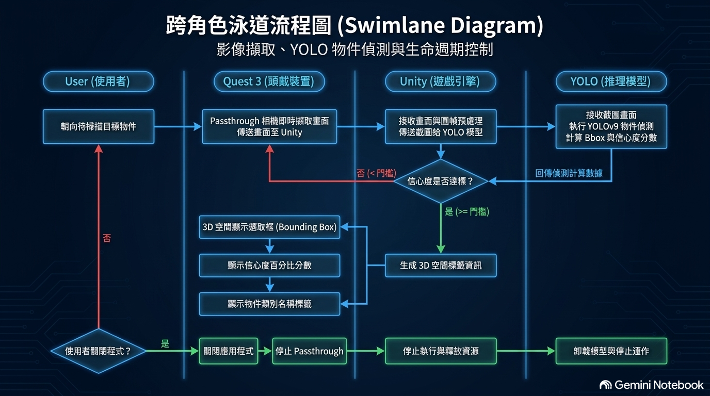
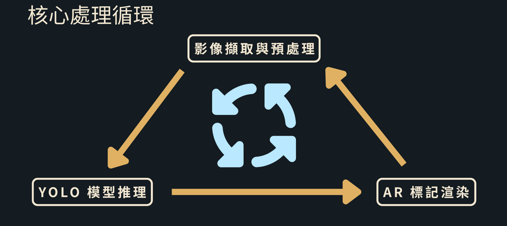
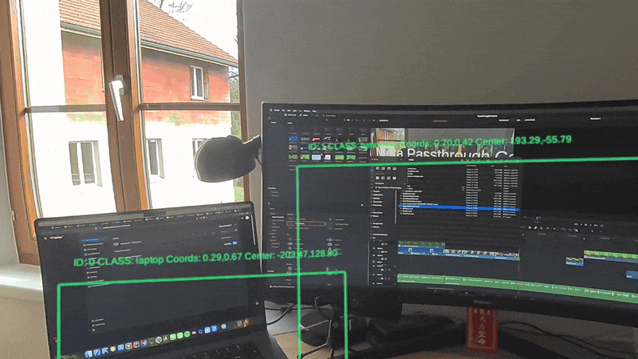
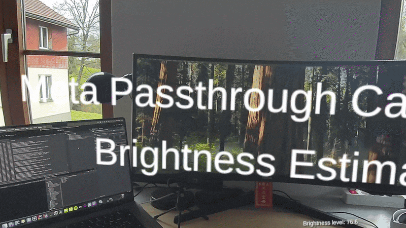
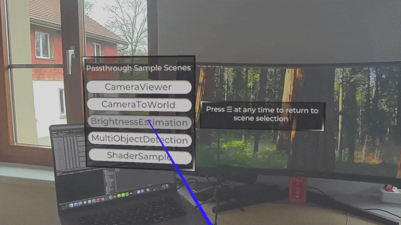
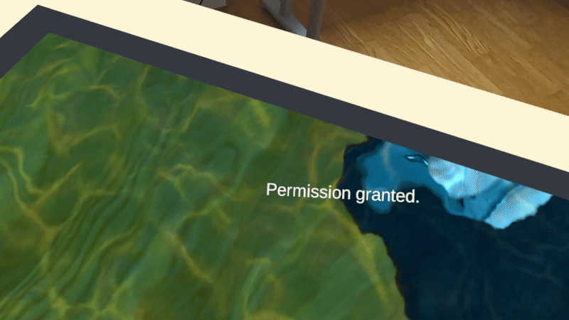

<div align="center">

# 🥽 [專案名稱] — 教室物件識別XR
### Meta Quest 3 × Unity 6 × YOLO × Unity Sentis


-3DDC84?logo=android)


<br/>
> 簡介：一款基於 Meta Quest 3 XR 功能，以 YOLO 模型即時辨識現實物體，且能達到教育目的的應用程式。
> **在Meta Quest 3上，透過Passthrough Camera即時辨識80種現實物件，**  
> **並以OVR空間錨點將3D標記精準固定於真實場景，完全本地推理、無需雲端。**

<br/>




**▶ 📦 [下載 APK](../../releases)　｜　🤖 [下載模型](../../releases)**
</div>

---

## 📌 目錄
- [專案亮點](#-專案亮點)
- [專案動機與目標](#-專案動機與目標)
- [系統架構](#-系統架構)
- [場景與模組說明](#-場景與模組說明)
- [核心技術解析](#-核心技術解析)
- [開發挑戰與解法](#-開發挑戰與解法)
- [快速開始](#-快速開始)
- [專案結構](#-專案結構)
- [未來規劃](#-未來規劃)
- [關於作者](#-關於作者)

---

## ✨ 專案亮點

| 特色 | 說明 |
|------|------|
| 🚀 **完全本地推理** | YOLO模型直接運行於Quest 3，無網路延遲、保護隱私 |
| 🎯 **雙模型支援** | 同時支援YOLOv8n（.onnx）與YOLOv9（.onnx / .sentis）|
| 📌 **空間錨點持久化** | OVRSpatialAnchor 將2D轉3D標記並固定於真實位置，不隨頭部飄移 |
| ⚡ **啟動預熱機制** | PreloadModel()消除首次推理卡頓，確保使用體驗流暢 |
| 🔁 **暫停/恢復推理** | 選單開啟時自動暫停推理，節省GPU資源 |
| 🛡️ **防重複標記** | 座標系轉換+Rect.Contains()演算法避免同位置重複生成 |
| 🎮 **直覺操作** | 左手進選單、右手A鍵生成3D標記 / B鍵清除全部，單手控制器操作 |

---

## 🎯 專案動機與目標

簡述：此專題用意為證明AI模型可以在Meta Quest 3這類獨立邊緣裝置上以純本地端運行。達到不連網、大幅降低隱私風險，且能大幅降低傳輸延遲，最後在教育等方面上進行應用。

## 🏗 系統架構

```
┌─────────────────────────────────────────────────────┐
│                  Meta Quest 3 硬體                   │
│         Passthrough Camera（左右雙鏡頭）              │
└──────────────────────┬──────────────────────────────┘
                       │ Texture2D（每幀）
                       ▼
          PassthroughCameraAccess
          （Meta MRUK SDK 封裝）
                       │
                       ▼
          TextureConverter.ToTensor()
          影像 → Float Tensor [1, 3, 640, 640]
                       │
                       ▼
┌──────────────────────────────────────────┐
│         Unity Sentis Worker              │
│   BackendType.GPUCompute / CPU           │
│   執行 YOLO 推理（On-Device）            │
│   ├── Output[0]: 小尺度偵測 (80×80)     │
│   ├── Output[1]: 中尺度偵測 (40×40)     │
│   └── Output[2]: 大尺度偵測 (20×20)     │
└──────────────────────┬───────────────────┘
                       │ 原始預測張量
                       ▼
          SentisInferenceRunManager
          NMS 後處理 → BoundingBoxData[]
          （類別 / 信心值 / 邊界框座標）
                       │
           ┌───────────┴───────────┐
           ▼                       ▼
  SentisInferenceUiManager    DetectionManager
  繪製 2D BoundingBox          A 鍵觸發
  顯示類別標籤 + 信心值        Instantiate 3D 標記
                               固定於 OVRSpatialAnchor
```





---

## 🗂 場景與模組說明

本專案包含多個獨立功能場景，均可在Quest 3上運行：

| 場景 | 路徑 | 功能說明 |
|------|------|---------|
| **MultiObjectDetection** | `Assets/PassthroughCameraApiSamples/MultiObjectDetection/` | ⭐ 核心場景：YOLO 即時物件偵測 + 3D 空間標記 |
| **BrightnessEstimation** | `Assets/.../BrightnessEstimation/` | 環境亮度估測，Passthrough Camera 光線分析 |
| **CameraToWorld** | `Assets/.../CameraToWorld/` | 相機座標系與世界座標系轉換示範 |
| **CameraViewer** | `Assets/.../CameraViewer/` | Passthrough Camera 原始畫面檢視 |
| **ShaderSample** | `Assets/.../ShaderSample/` | XR Passthrough 自定義 Shader 效果 |
| **StartScene** | `Assets/.../StartScene/` | 主選單入口，含 Debug UI 系統 |

---
## 🔬 核心技術解析

### ✨ 核心技術重點

- **XR 整合**：整合Meta XR SDK，提取Passthrough即時彩色透視影像串流作為輸入源，並結合控制器與手勢追蹤實作沉浸式3D UI互動。
- **模型部署**：使用PyTorch進行ONNX格式轉換與結構優化，並使用Unity Sentis作為本地端推論引擎執行預訓練YOLOv9模型。
- **效能優化**：針對固有算力瓶頸，設計非同步推論與GPU算力排程，避免Unity主執行緒滿溢，搭配影像分類抽樣。
- **座標轉換**： 研究並調校NMS/IoU演算法排除重疊框，並透過相機內參數及射線投射，將2D影像邊界框中心點轉換為3D實體空間座標完成3D標籤錨定。

### 1️⃣ 模型預熱：消除首次推理卡頓

第一次 GPU 推理會觸發 Shader 編譯，凍結畫面 3～5 秒。  
解法：App 啟動時用假圖執行一次完整推理，提前完成編譯。

```csharp
internal static void PreloadModel(ModelAsset modelAsset)
{
    var model = ModelLoader.Load(modelAsset);
    using var worker = new Worker(model, BackendType.CPU);

    // 用 2×2 假圖觸發完整推理流程
    Texture tempTexture = new Texture2D(2, 2, TextureFormat.RGBA32, false);
    using var input = new Tensor<float>(
        new TensorShape(1, 3, inputShape.Get(2), inputShape.Get(3))
    );
    TextureConverter.ToTensor(tempTexture, input, textureTransform);
    worker.Schedule(input);

    // 同步等待所有輸出完成（三個 YOLO 偵測頭）
    worker.PeekOutput(0).CompleteAllPendingOperations();
    worker.PeekOutput(1).CompleteAllPendingOperations();
    worker.PeekOutput(2).CompleteAllPendingOperations();
    Destroy(tempTexture);
}
```

### 2️⃣ 主推理迴圈：暫停/恢復控制

```csharp
private IEnumerator Start()
{
    m_uiInference.SetLabels(m_labelsAsset); // 初始化 80 類別標籤

    while (true)
    {
        // 選單開啟時暫停推理，節省 GPU 資源
        while (m_uiMenuManager.IsPaused)
            yield return null;

        yield return RunInference(); // 執行一次推理後繼續迴圈
    }
}
```

### 3️⃣ 防重複標記演算法

```csharp
bool HasExistingMarkerInBoundingBox(BoundingBoxData box)
{
    foreach (var marker in m_spawnedEntities)
    {
        if (marker.GetYoloClassName() == box.ClassName)
        {
            // 世界座標 → BoundingBox 本地座標系轉換
            Vector2 localPos = box.BoxRectTransform
                                  .InverseTransformPoint(marker.transform.position);

            // 以中心點為原點建立矩形範圍判斷
            var sizeDelta = box.BoxRectTransform.sizeDelta;
            var currentBox = new Rect(
                -sizeDelta.x * 0.5f, -sizeDelta.y * 0.5f,
                 sizeDelta.x, sizeDelta.y
            );

            if (currentBox.Contains(localPos)) return true; // 已存在，不重複生成
        }
    }
    return false;
}
```

### 4️⃣ 空間錨點持久化

```csharp
// 建立錨點並等待 Localized 後儲存
m_spatialAnchor = contentParent.AddComponent<OVRSpatialAnchor>();
while (!m_spatialAnchor.Localized) yield return null;

var result = await m_spatialAnchor.SaveAnchorAsync();
if (!result.Success) { EraseSpatialAnchor(); yield break; }
```

---

## 🔧 開發挑戰與解法

### ❌ 挑戰 1：Quest 3上執行PyTorch模型無法得到高效能
   **原因**：原因為跨記憶體區塊的頻繁複製
   **解法**：轉換成ONNX並用Sentis做裝置端推論，且因Sentis為原生開發的推論引擎，能大幅提升該FPS
### ❌ 挑戰 2：主執行緒同步推論導致畫面卡住與嚴重暈眩感
   **原因**：原因為同步推論會霸佔主執行緒
   **解法**：採非同步推論結合分頻抽樣，確保畫面有資源能夠進行渲染
### ❌ 挑戰 3：2D邊界框雜訊導致3D空間標籤頻繁位移與調整位置
   **原因**：原因為2D轉3D並且在使用者移動的狀態下導致空間位置偏移
   **解法**：改採空間錨定機制，並在移動狀態下偵測錨定位移，如位移後超時則刪除
   
---

## 🚀 快速開始

### 環境需求

| 類別 | 使用技術 |
|---|---|
| 引擎 | Unity 6000.3.2f1 |
| 邊緣裝置 | Meta Quest 3 |
| XR SDK | Meta XR SDK |
| 物件偵測模型 | YOLOv9 |
| 推論框架 | Unity Sentis / ONNX Runtime |
| 語言 | C# / Python(轉模型用) |
| 開發者模式 | Quest 3 已開啟 |

### 安裝步驟

```bash
# 1. Clone 專案
git clone https://github.com/你的帳號/Unity-PassthroughCameraApiSamples.git
cd Unity-PassthroughCameraApiSamples

# 2. 用 Unity Hub 開啟（選擇 Unity 6000.3.2f1 or Unity 6000.x 可相容版本）
#    File → Open Project → 選擇此資料夾

# 3. 下載 YOLO 模型（不含於 repo，請至 Releases 下載）
#    → 下載 yolov8n.onnx 與 yolov9onnx.onnx 也可自行嘗試衍生模型 / 改進版本模型
#    → 放置於以下路徑：
#    Assets/PassthroughCameraApiSamples/MultiObjectDetection/SentisInference/Model/

# 4. 連接Meta Quest 3（USB + 開發者模式）
#    File → Build Profiles → Android → Build And Run
```

> ⚠️ **模型下載**：請至 [Releases](../../releases) 頁面下載 ONNX 模型檔案（因體積較大未含於 repo）

### 操作說明

| 按鍵 | 功能 |
|------|------|
| **A 鍵**（放開）| 在當前偵測框位置生成 3D 空間標記 |
| **B 鍵**（按下）| 清除所有已生成的 3D 標記 |
| **MENU 鍵** | 開啟/關閉選單（暫停推理） |

---

## 📂 專案結構

```
Unity-PassthroughCameraApiSamples/
├── Assets/
│   └── PassthroughCameraApiSamples/
│       ├── MultiObjectDetection/          ⭐ 核心功能
│       │   ├── DetectionManager/
│       │   │   └── Scripts/
│       │   │       ├── DetectionManager.cs          # 主控：輸入/標記/錨點
│       │   │       ├── DetectionSpawnMarkerAnim.cs  # 3D 標記動畫
│       │   │       ├── DetectionUiMenuManager.cs    # 選單控制
│       │   │       └── DetectionUiTextWritter.cs    # UI 文字
│       │   └── SentisInference/
│       │       ├── Model/
│       │       │   ├── yolov8n.onnx                 # (請至 Releases 下載)
│       │       │   ├── yolov9onnx.onnx              # (請至 Releases 下載)
│       │       │   ├── yolov9sentis.sentis           # (請至 Releases 下載)
│       │       │   ├── coco_classes.txt             # COCO 80 類別（英文）
│       │       │   └── SentisYoloClasses.txt        # 類別標籤
│       │       └── Scripts/
│       │           ├── SentisInferenceRunManager.cs # AI 推理核心
│       │           └── SentisInferenceUiManager.cs  # BoundingBox UI
│       ├── BrightnessEstimation/          亮度估測
│       ├── CameraToWorld/                 座標轉換
│       ├── CameraViewer/                  相機預覽
│       ├── ShaderSample/                  Shader 效果
│       └── StartScene/                   主選單
├── docs/
│   ├── demo.gif                           ⭐ 主 Demo 動圖
│   └── demo2.gif
├── Media/
│   ├── ObjectDetectionSentis.gif          物件偵測展示
│   ├── BrightnessEstimation.gif
│   ├── CameraToWorld.gif
│   └── ShaderSample.gif
├── Packages/
│   ├── manifest.json                      套件清單
│   └── packages-lock.json
└── ProjectSettings/                       Unity 專案設定
```

---

## 🔮 未來規劃

- [ ] 模型量化（INT8 / FP16）提升Quest 3推理FPS
- [ ] 支援自訂YOLO訓練模型（Custom Classes）
- [ ] 多人共享空間錨點（Shared Spatial Anchors）
- [ ] 語音播報偵測結果（TTS 整合）
- [ ] 信心值閾值滑桿（Inspector 即時調整）
- [ ] 教育場景應用：AR教具辨識輔助學習系統

---

## 🖼 更多展示

| 功能 | 預覽 |
|------|------|
| 多物件即時偵測 |  |
| 亮度估測 |  |
| 座標轉換 |  |
| Shader 效果 |  |

---

## 👤 關於作者

**Work hardog**

> 正在實習，擔任視覺模型相關實習生，從事視覺模型相關研究開發。

| | |
|---|---|
| 🔭 研究方向 | XR 開發、On-Device AI 推理、電腦視覺、物件偵測 |
| 🛠 技術棧 | C#、Python、Unity 6、Meta XR SDK、YOLO、Unity Sentis、ONNX |
| 🐙 GitHub | [@Workhardog](https://github.com/Workhardog) |

---

## 📄 授權

本專案採用 [MIT License](LICENSE.txt) 授權。  
部分程式碼來自 [Meta Passthrough Camera API Samples](https://github.com/meta-openxr-samples)，依原授權條款使用。

---

<div align="center">

**如果這個專案對你有幫助，歡迎給個 ⭐ Star！**

*Built with ❤️ using Unity 6 × Meta Quest 3 × YOLO × Unity Sentis*

</div>